<div style="font-size:500%;font-weight:bold"> </div>

# Accelerate data preparation using Amazon SageMaker Data Wrangler for Diabetic Patient Readmission Prediction

Patient readmission to hospital after prior visits for the same disease results in additional burden on healthcare providers, health system and patients. Machine Learning (ML) models if built and trained properly can help understand reasons for readmission, and predict readmission accurately. ML could allow providers to create a better treatment plans and care which would translate to reduction of both cost and mental stress for patients. However, ML is a complex technique that has been limiting organizations that do not have the luxury to recruit a team of data engineers and scientists to build ML workloads. In this example, we show you how to build a machine learning model to predict diabetic patient readmission easily and quickly with a graphical interface from Amazon SageMaker Data Wrangler.

[Amazon SageMaker Data Wrangler](https://aws.amazon.com/sagemaker/data-wrangler/) is an [Amazon SageMaker Studio](https://aws.amazon.com/sagemaker/studio/) feature designed to allow users to explore and transform tabular data for machine learning use cases without coding. Amazon SageMaker Data Wrangler is the fastest and easiest way to prepare data for Machine Learning. It gives you the ability to use a visual interface to access data, perform exploratory data analysis (EDA) and feature engineering. It also seamlessly operationalizes your data preparation steps by allowing to export data flow into [Amazon SageMaker Pipelines](https://aws.amazon.com/sagemaker/pipelines/), Amazon SageMaker Data Wrangler job, Python file or [Amazon SageMaker Feature Store](https://aws.amazon.com/sagemaker/feature-store/).

Amazon SageMaker Data Wrangler comes with over 300 built-in transforms, custom transformations using either Python, PySpark or SparkSQL runtime.  It also comes with built-in data analysis capabilities for charts (eg, scatterplot or histogram) and time-saving model analysis capabilities such as Feature importance, Target leakage and Model explainability.

In this step-by-step example, you will be running machine learning workflow with Amazon SageMaker Data Wrangler and Amazon SageMaker features using a HCLS dataset.

Here are the high-level activities:

1. [Load UCI Source Dataset into your S3 bucket](#1-source-dataset)
1. [Design your DataWrangler flow file](#2-design-your-dataWrangler-flow-file)
1. [Processing & Training Jobs for Model building](#3-processing-and-training-jobs-for-model-building)
1. [Host trained Model for real-time inference](#4-Host-trained-Model-for-real-time-inference)

## 1. Source Dataset

[UCI diabetic patient readmission dataset](https://archive.ics.uci.edu/ml/datasets/diabetes+130-us+hospitals+for+years+1999-2008). The dataset represents 10 years (1999-2008) of clinical care at 130 US hospitals and integrated delivery networks. It includes over 50 features representing patient and hospital outcomes.

You will start by downloading the dataset and uploading it to a S3 bucket for you to run the example. Please review and execute the code in [datawrangler_workshop_pre_requisite.ipynb](datawrangler_workshop_pre_requisite.ipynb). The data will be available in `s3://sagemaker-${region}-${account_number}/sagemaker/demo-diabetic-datawrangler/` if you leave everything default.

## 2. Design your DataWrangler flow file

###  Data Wrangler flow overview and highlights

This project comes with a pre-built Data Wrangler flow file that can be customized with your `s3Uri` for reusability: [datawrangler_diabetes_readmission.flow](datawrangler_diabetes_readmission.flow).

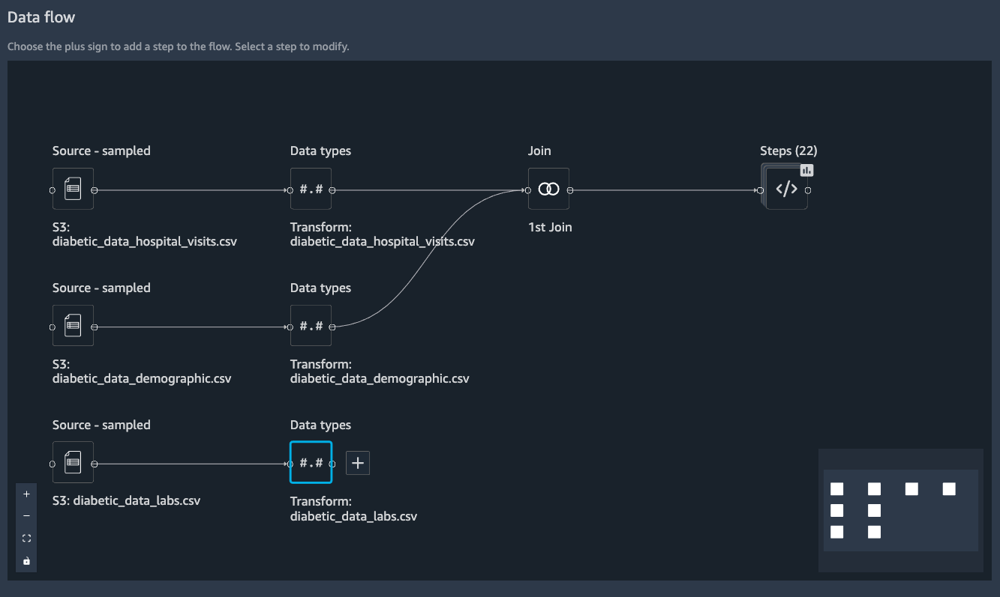

It has multiple files from S3 loaded in: `diabetic_data_hospital_visits.csv`, `diabetic_data_demographic.csv` and `diabetic_data_labs.csv` for demonstration. It performs a inner join between the tables in `diabetic_data_hospital_visits.csv` and `diabetic_data_demographic.csv` by `encounter_id`. It has 28 transformation steps applied to process the data to meet the following requirements:

* no duplicate columns
* no duplicate entries
* no missing values (either fill the missing ones or remove columns that are largely missing)
* one hot encode the categorical features
* ordinally encode the age feature
* normalization (Standard scaler)
* Custom Transformation (Feature Store - EventTime needed)
* Analysis (Quick Model, Histogram)
* ready for ML training (Export notebook steps)

These are analyses created at different stage of the wrangling to serve as indication of the value these wrangling steps add. Most noticeably the Quick Model tells us that patient readmission prediction increases F1 score after performing transformation steps between 1 and 28 (in [datawrangler_diabetes_readmission.flow](datawrangler_diabetes_readmission.flow)).  Data Scientists can use `Quick Model` analysis to perform iterative experimentation leading to efficient feature engineering for ML.

In this lab, we will perform data preprocessing using a combination of transformations described below to demonstrate the capability of Amazon SageMaker Data Wrangler. We will then train a XGBoost model to show you the process after data wrangling. We will then be hosting a trained model to SageMaker Hosted Endpoint for real-time inferencing.

##  Walk through

### Create a new flow

Please click on the **SageMaker component and registry** tab and click **New flow**.

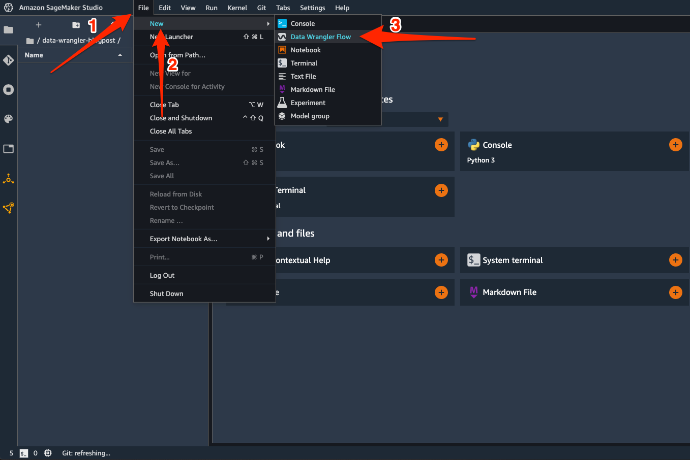

### Rename your DW dataflow file

Right click on the **untitled.flow** file tab to reveal below options.  Then choose Rename file to change the file name.

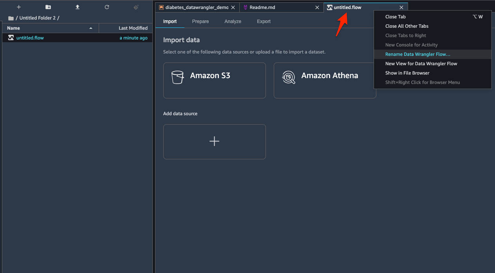

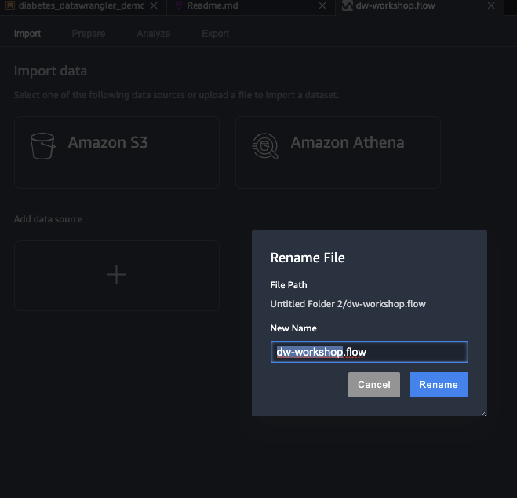

### Load the data from S3 into Data Wrangler

Select Amazon S3 as data source in **Import Data** view.

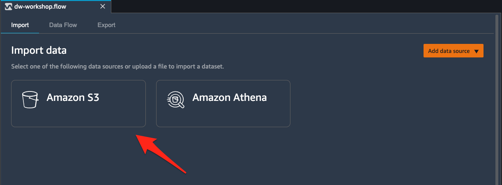

*Note: You could also import data from Athena: [how databases and tables in Amazon Athena can be imported](https://docs.aws.amazon.com/sagemaker/latest/dg/data-wrangler-import.html#data-wrangler-import-athena).*

Select the csv files from the bucket: `s3://sagemaker-${region}-${account_number}/sagemaker/demo-diabetic-datawrangler/` one at a time.

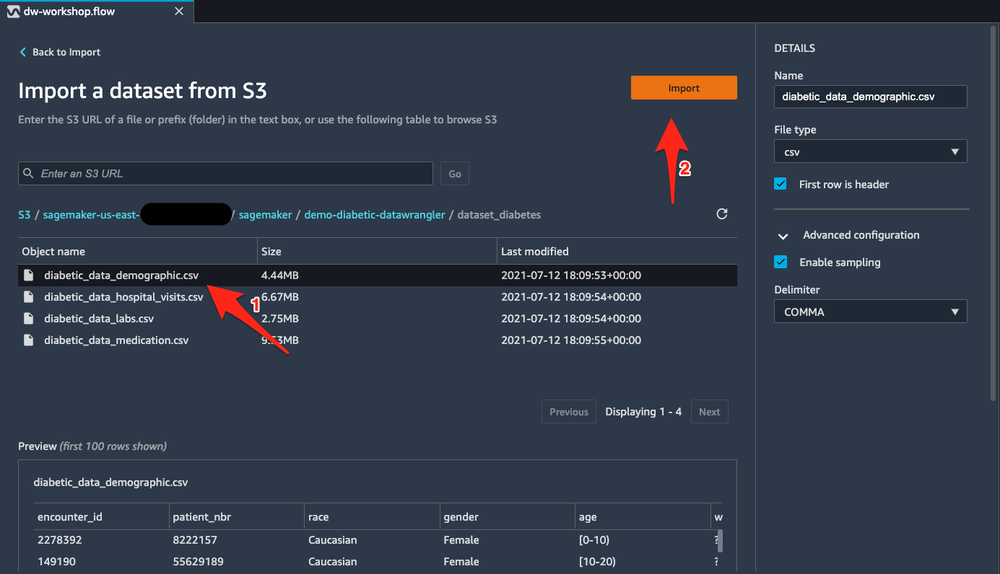

### Join the CSV files

1) Click the + sign on the Data-types icon for `diabetic_data_demographic.csv` Select **Join** and new panel is presented for configuring input dataset join.

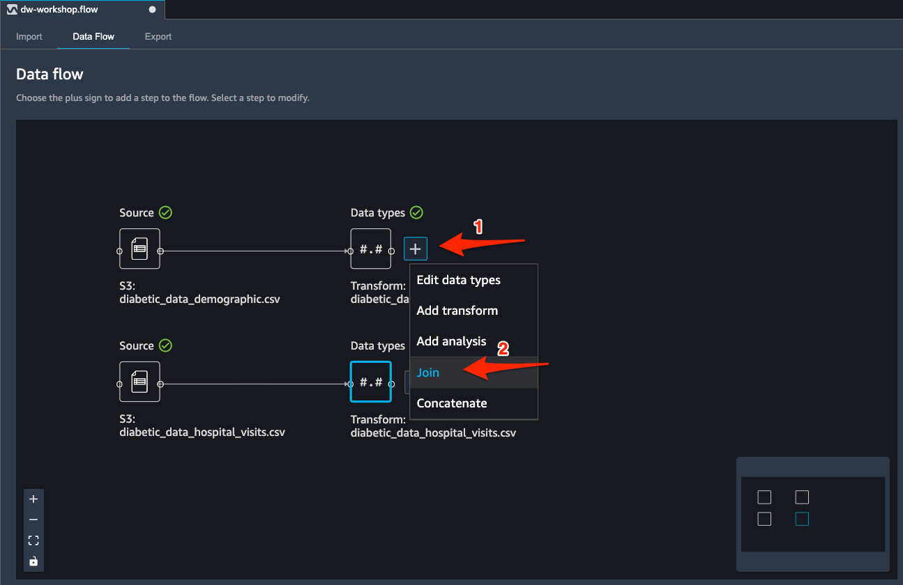

2) Select `diabetic_data_hospital_visits.csv` dataset as Right dataset.

3) Click `Configure` to setup Join criteria.

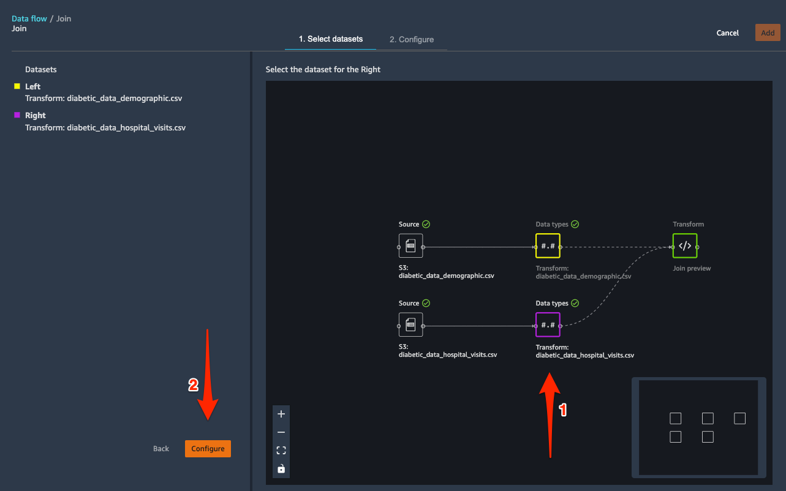

4) Give a name to the Join and choose join type and Left & Right columns for join condition

5) Click `Apply` to preview the joined dataset and `Add` for the previewed join configuration to be added to the data-flow file.

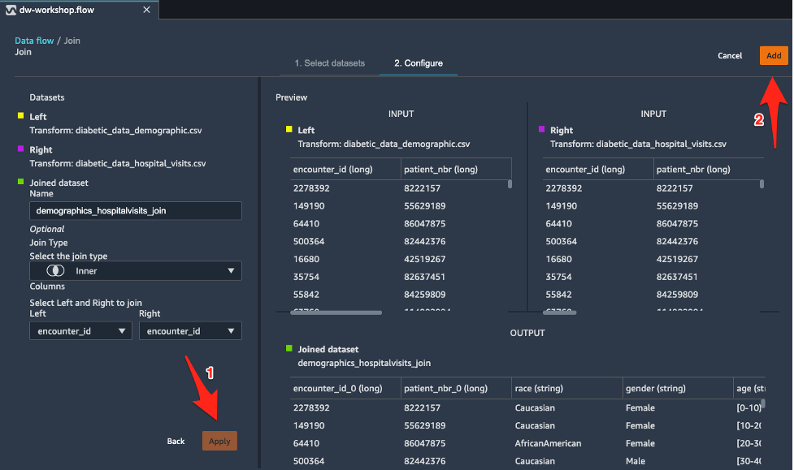


###  Built-in Analysis

Before we apply any transformations on the input source, let's perform a quick analysis of the dataset. SageMaker Data Wrangler provides number of built-in Analysis types like `Histogram`, `Scatter Plot`, `Target Leakage`, `Bias Report` & `Quick Model`. You can find all analyses types documentation under [SageMaker Data Wrangler Analyses](https://docs.aws.amazon.com/sagemaker/latest/dg/data-wrangler-analyses.html).

### Target Leakage

Target leakage occurs when there is data in a ML training dataset that is strongly correlated with the target label, but is not available in real-world data.  For example, you may have a column in your dataset that serves as a proxy for the column you want to predict with your model.  Data Wrangler calculates the predictive metric of ROC which is computed individually for each column via cross validation to generate Target Leakage Report.

1.	Click + sign next to Join flow icon and choose Add analysis

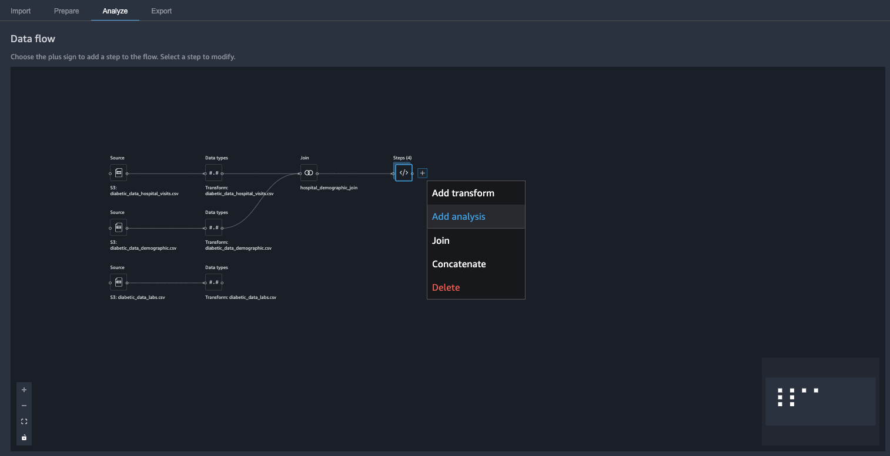

2.	Select `Target Leakage` from the list of `Analysis type` drop down on the right panel.
3.	Give a name to your analysis and specify Max features as `50`, Problem Type as `classification` and Target as `readmitted`.
4.	Click `Preview` to generate below report. 

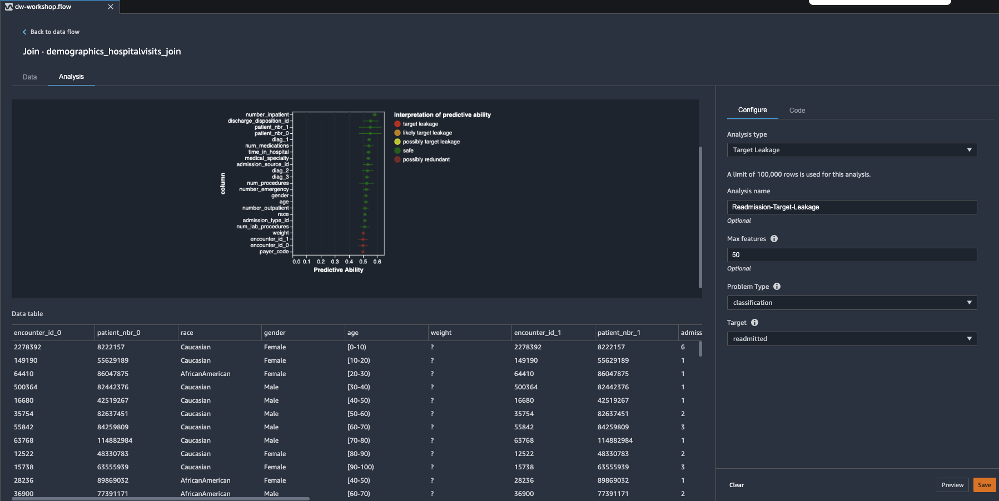

5.	As shown, there is no indication of Target leakage in our input dataset.  However, a few features like encounter_id_1, encounter_id_0, weight & payer_code are marked as possibly redundant with 0.5 Predictive ability of ROC.  This means these features by themselves are not providing any useful information towards predicting the target.  Before making the decision to drop these uninformative features, you should consider whether these could add value when used in tandem with other features.  For our use-case, we’ll drop these in `Transforms` section in an effort to prepare our training dataset.
6.	Click `Save` to save the analysis into your Data Wrangler data flow file.


### Bias Report

AI/ML systems are only as good as the data we put into them.  ML based systems are more accessible than ever before and with the growth of adoption throughout various industries, further questions arise surrounding fairness and how it is ensured across these ML systems. Understanding how to avoid and detect bias in ML models is imperative and complex.  Using Data Wrangler’s built-in Bias Report analysis, data scientists can quickly detect bias during data preparation stage of ML workflow.  Bias Report analysis uses [Amazon SageMaker Clarify](https://aws.amazon.com/sagemaker/clarify/) to perform bias analysis.  
To generate a bias report, you must specify the target column that you want to predict and a Facet/Column that you want to inspect for potential biases. For example, we can generate a bias report on gender feature for Female values to see whether there is any Class Imbalance (CI).

1.	While on the Analysis tab, click `Create new analysis` button to open analysis creation panel.

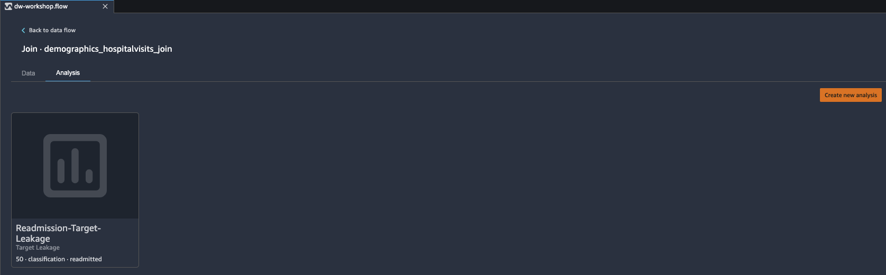

2.	Select `Bias Report` from the list of Analysis type drop down on the right panel.
3.	Give a name to your analysis and select the target label as `readmitted` and choose Value as `NO`.
4.	Select `gender` for column to analyze and provide value as `Female`.
5.	Leave everything else as default and click `Check for bias` to generate the bias report.

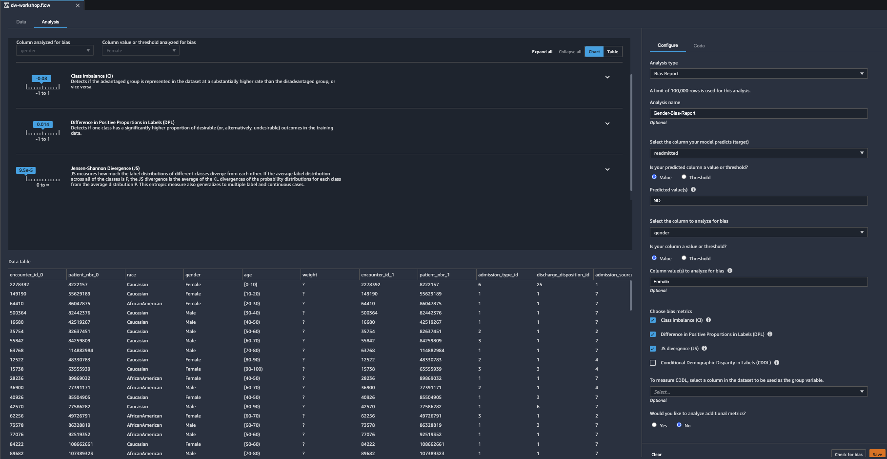

6.	As you can see there is no significant bias in our input dataset, which means the dataset has fair amount of representation by gender feature.  For our dataset, we can move forward with a hypothesis that there is no inherent bias in our dataset.  However, based on your use-case and dataset, you might want to run similar bias reporting on various other features of your dataset to identify any potential bias.  If any bias is detected, you can consider applying suitable transformation to address that bias.
7.	Click Save to add this report to the dataflow file.


### Histogram

You can use histograms to see the counts of feature values for a specific feature. You can inspect the relationships between features using the Color by option. You can also use the Facet by feature to create histograms of one column, for each value in another column.

Here we’ll use Histogram to gain insights into target label patterns inside our input dataset.

1.	While on the Analysis tab, click Create new analysis button to open analysis creation panel.
2.	Select `Histogram` from the list of Analysis type drop down on the right panel.
3) Give a name to your analysis and select the `X axis` as `race`, `Color by` as `age` & `Facet by` as `gender`.  Which means we want to plot histograms by `race` with `age` factor reflected by color legend and also faceted by `gender`.
4.	Click `Preview` to generate resulting Histogram as shown below. 

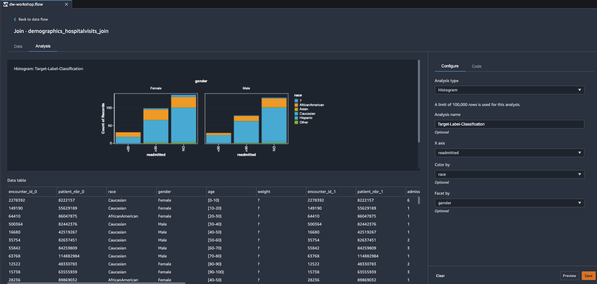

As you can see, this ML problem is a `Multi-class Classification` problem.  However, here we see that there is major target class imbalance between readmitted `<30` days, `>30` days and `NO` readmission.  We also notice that these two classifications are proportionate across `gender` and `race`.  To improve our potential model predictability, we can decide to merge `<30` & `>30` into single positive class.  This merge of target label classification will turn our ML problem into a `Binary Classification`.  As you’ll see in next section, we can do this easily by adding respective transformations.

### Transformations

When it comes to training ML model for structured/tabular data, decision-tree based algorithms are considered best-in-class.  This is due to their inherent technique of applying ensemble tree methods in order to boost weak learners using the gradient descent architecture.  

For our medical source dataset, we’ll be using Amazon SageMaker built-in XGBoost algorithm as it is one of the most popular decision-tree based ensemble ML algorithm.  XGBoost algorithm can only accept numerical values as input, hence a pre-requisite here is we must apply categorical feature transformations on our source dataset.

As stated, Data Wrangler comes with over 300 built-in transforms which require no coding.  Let’s use built-in transforms to apply a few key transformations and prepare our training dataset.

###  Handle missing values 

1) Click + sign next to Join flow icon and choose `Add Transform`

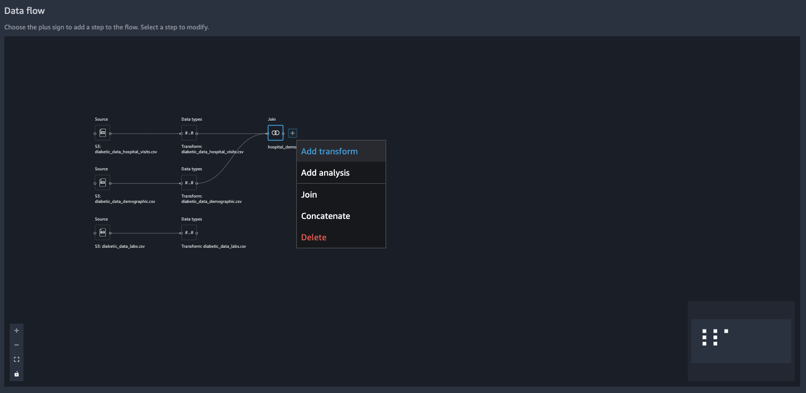

2) Pick `Handle missing` from the list of transforms on the right panel and choose `Impute` for Transform

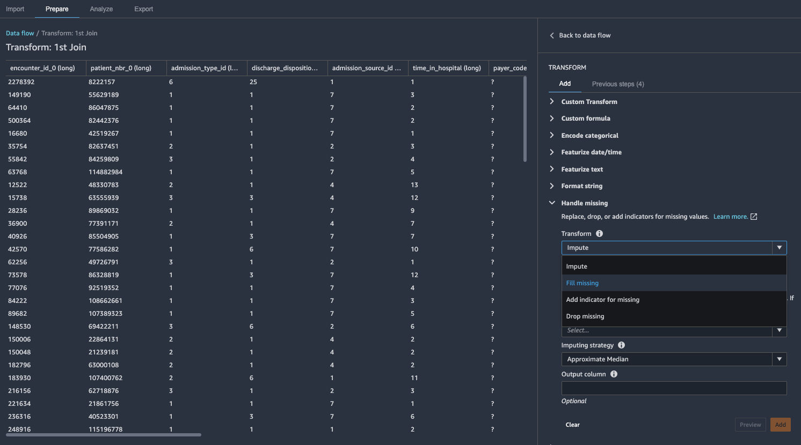

3) Choose `Column type` as `Numeric` and select `Input column` as `diag_1`.  Let's use `Mean` for `Imputing strategy`.  You can also provide optional Output column name. By default, the operation is performed in-place, however, you can also provide optional Output column name which will create new column with imputed values.

4) Click `Preview` to preview the results as show below.  Once verified, click `Add` to include this transformation step into Data Wrangler dataflow file.

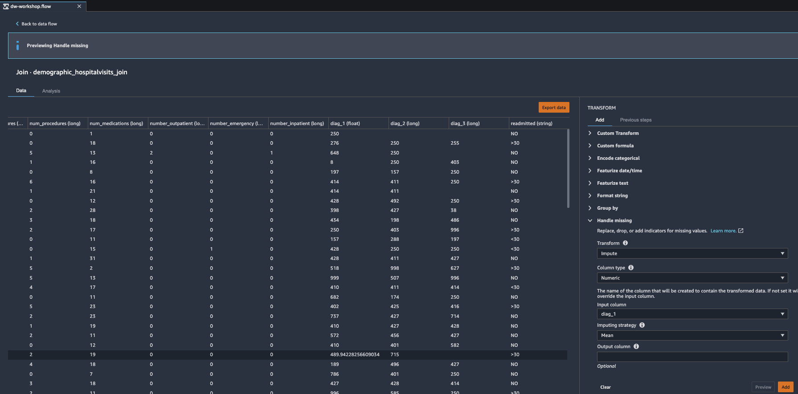

5) Repeat above steps 1 through 3 for `diag_2` & `diag_3` features and impute missing values.

###  Search and edit features with special characters 

As our source dataset has features with special characters, we need to clean them before training. Let's use Search and Edit Transform.

1. Pick `Search and edit` from the list of transforms on the right panel. Select `Find and replace` substring 

2. Select the target column `race` for Input column and use `\?` regex for Pattern. For the `Replacement String` use `Other`. Let’s leave `Output Column` blank for in-place replacements.

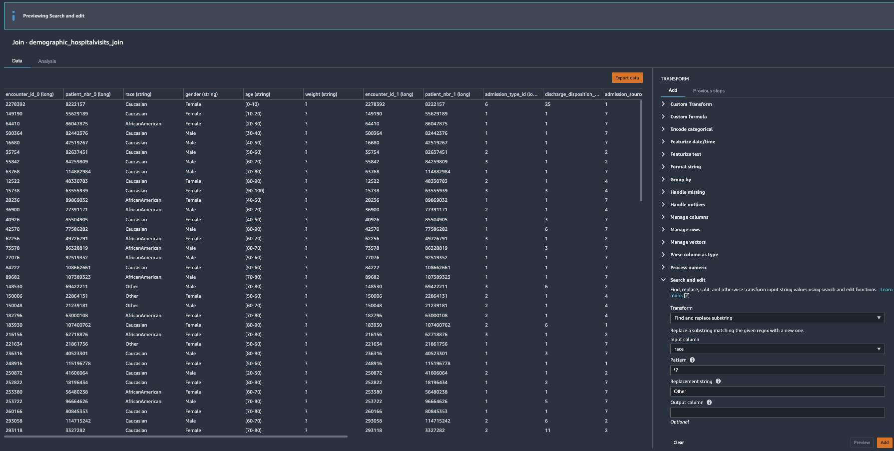

3. Once reviewed, click `Add` to add the transform to your data-flow.

4. Repeat the same technique for other features to replace `weight`, `payer_code` with `0` and `medical_specialty` with `Other` as shown below.

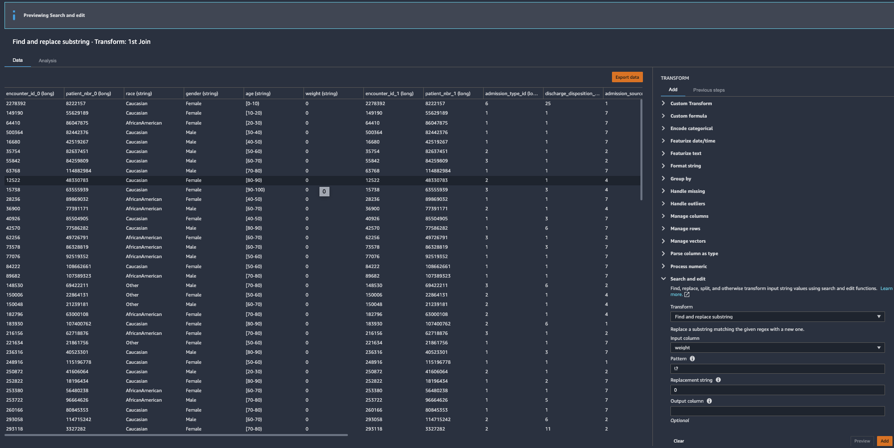

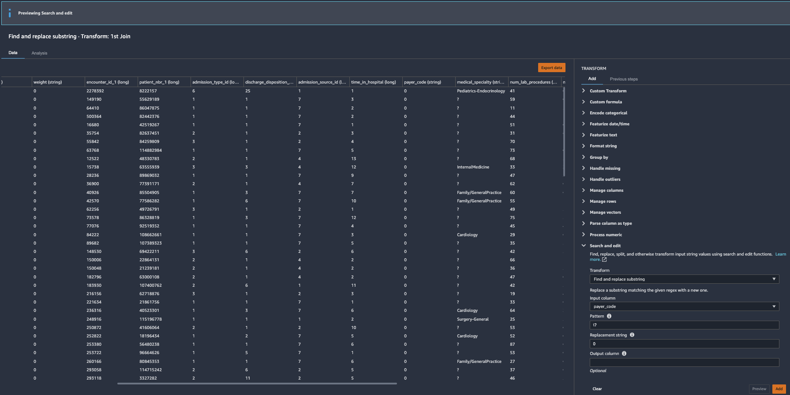

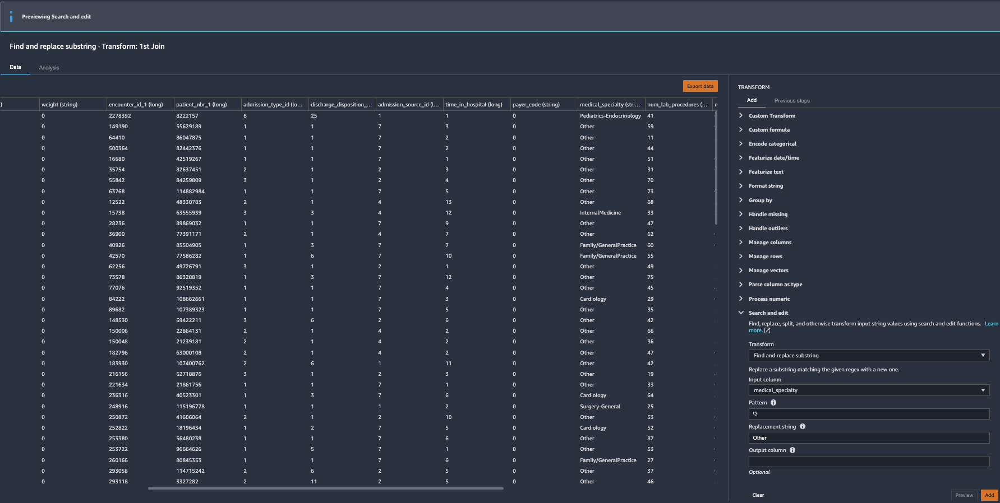

###  One-hot Encoding for categorical features 

1) Pick `Encode categorical` from the list of transforms on the right panel. Select `One-hot encode` and `race` for input column.  For `Output style`, choose `Columns`.  After filling the fields click `Preview`

2) After review the transformation results, Click `Add` to add the change to the data flow

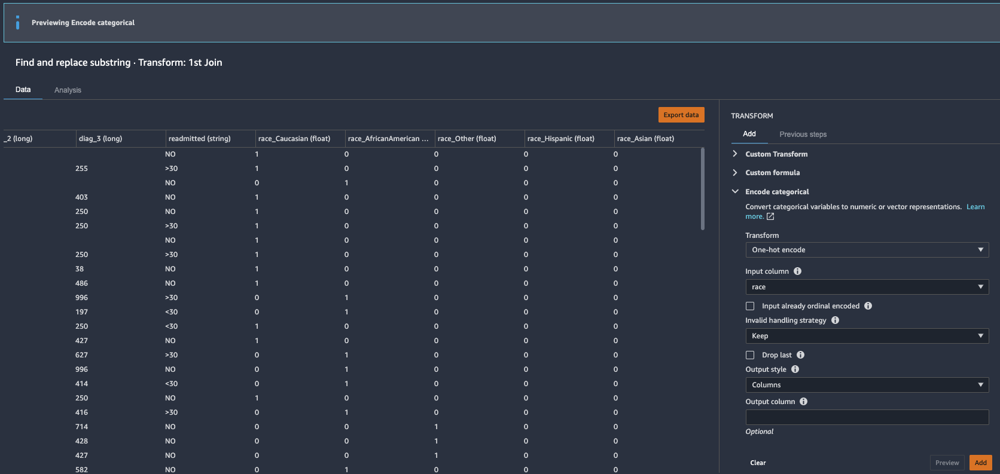

3) Repeat above 2 steps for `age` and `medical_specialty_filler` to one-hot encode those categorical features as well.


###  Ordinal Encoding for categorical features 

1) Pick `Encode categorical` from the list of transforms on the right panel. Select `Ordinal encode` and `gender` for input column.  For `Invalid handling strategy` select `skip`.  After filling the fields click `Preview`

2) After review the transformation results, Click `Add` to add the change to the data flow

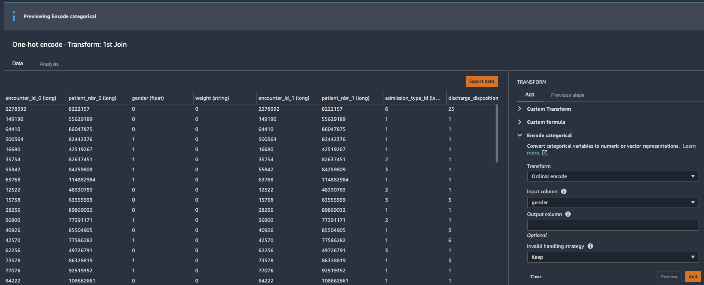

###  Custom Transformations – Add new features to your dataset

If we choose to store our transformed features into Amazon SageMaker Feature Store, a pre-requisite is to insert Event-Time feature into the dataset.  We can easily do that using Custom Transformations

1) Pick `Custom Transform` from the list of transforms on the right panel

2) select `Python (Pandas)` and enter below line of code in the text box.  Then click `Preview` to view the results.

```
# Table is available as variable `df`
import time
df['eventTime'] = time.time()
```


3) Click `Add` to add the change to the data flow


###  Transform the target Label 

The target label readmitted has 3 classes: NO readmission, readmitted <30 days and readmitted >30 days. We saw in our `Histogram` analysis that there is a strong class imbalance as majority of the patients did not readmit. We could combine the latter two classes into a positive class to denote the patients being readmitted, and turn the classification problem into a binary case instead of multi-class. Let's use Search and Edit Transform to convert string values to binary values.

1) Pick `Search and edit` from the list of transforms on the right panel. Select `Find and replace substring` 

2) Select the target column `readmitted` for `Input column` and use `>30|<30` regex for `Pattern`. For the Replacement String use `1`. 

3) So, here we are converting all the values that have either `>30` or `<30` values to `1`. After making your config selections, hit `Preview` to review the converted column as shown below.

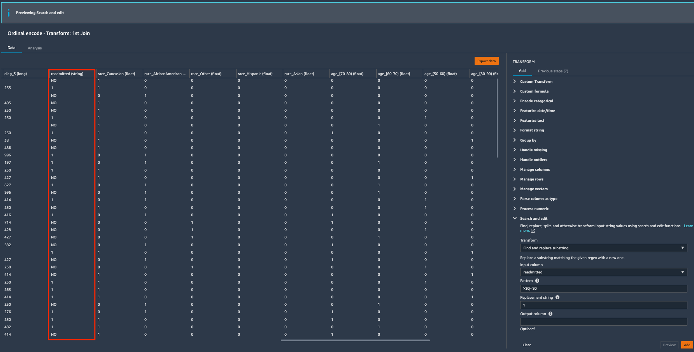

4) Once reviewed, click `Add` to add the transform to your data-flow.

5) Let's repeat the same to convert `NO` values to `0`.  Pick `Search and edit` from the list of transforms on the right panel. 

6) Choose `Find and replace` substring transform.  Select the target column `readmitted` for Input column and use `NO` regex for `Pattern`. For the Replacement String use `0`. 

7) After making your config selections, hit `Preview` to review the converted column as shown below.


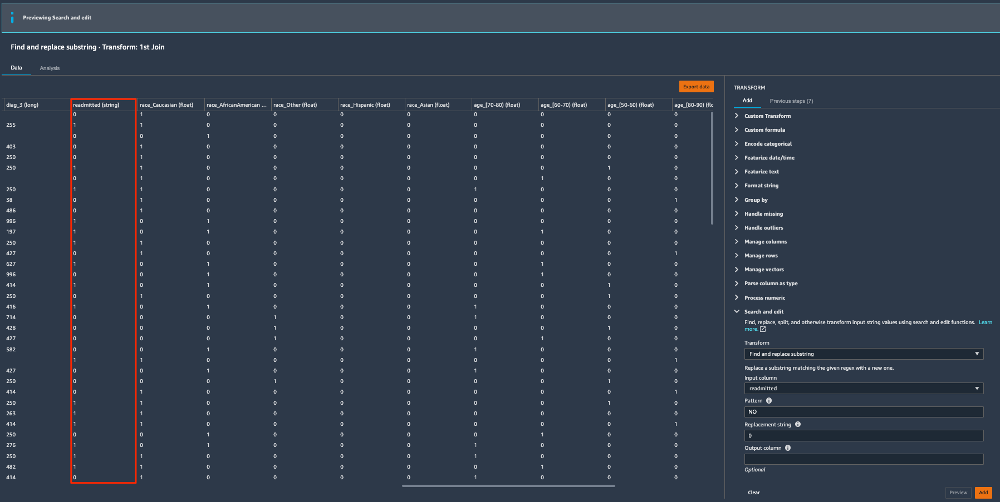


5) Once reviewed, click `Add` to add the transform to your data-flow.  Now our target label is ready for ML.


###  Position the target label as first column to utilize XGBoost algorithm 

As we are going to use XGBoost built-in SageMaker algorithm to train the model, the algorithm assumes that the target label is in the first column. Let's do that.

1) Pick `Manage Column` from the list of transforms on the right panel. Select `Move Column` for Transform and select `Move to start` for Move type. Provide a name to new column `readmitted`. After filling the fields click `Preview`

2) After reviewing the transformation results, Click `Add` to add the change to your data flow

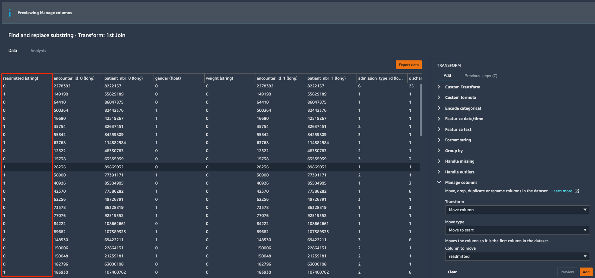


###  Let's Drop redundant columns 

1) Pick `Manage Columns` from the list of transforms on the right panel
2) Choose `Drop Column` transform and select `encounter_id_0` for column to drop

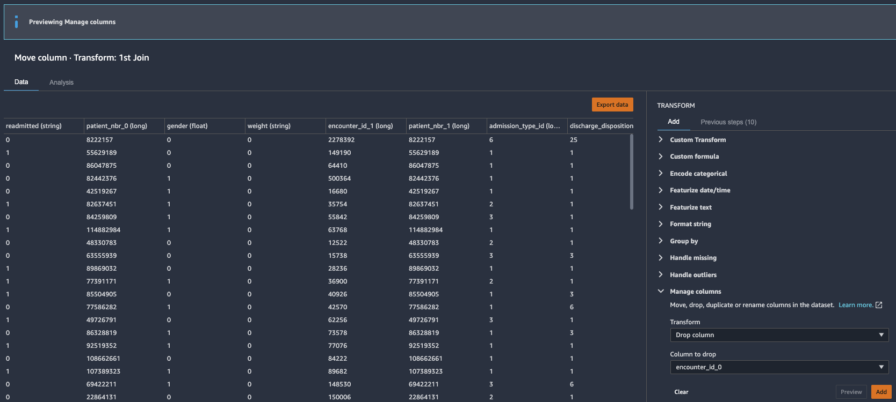

3) Click `Preview` to preview the changes to the data set. Then `Add` to add the changes to flow file.

4) Repeat above steps 1 through 3 for other redundant columns `patient_nbr_0`, `encounter_id_1`, `patient_nbr_1`. 

At this stage, we have done a few analyses and applied a few transformations on our raw input dataset.  If we choose to preserve the transformed state of the input dataset, kind a like checkpoint, you can do that using the Export data button shown below.  This option will allow you to persist the transformed dataset on to an Amazon S3 bucket.

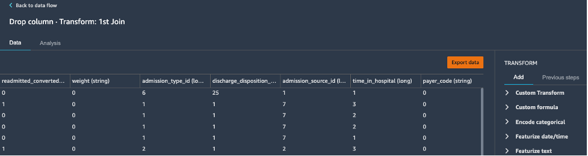

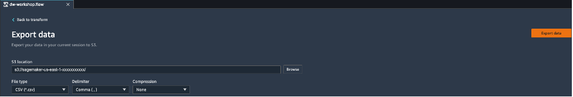

###  Quick Model Analysis

Now that we have applied transformations to our initial dataset, let’s explore Quick Model analysis.  Quick Model helps to quickly evaluate the training dataset and produce importance scores for each feature. A feature importance score indicates how useful a feature is at predicting a target label. The feature importance score is between [0, 1] and a higher number indicates that the feature is more important to the whole dataset. Since our use-case relates to classification problem type, Quick Model also generates F1 score for current dataset.

1) Click + sign next to Join flow icon and choose `Add analysis`


2) Select `Quick Model` from the list of Analysis types on the right panel.

3) Give a name to your analysis and select the target label in `Label` field.

4) Click `Preview` and wait for the model to be results to be displayed on the screen

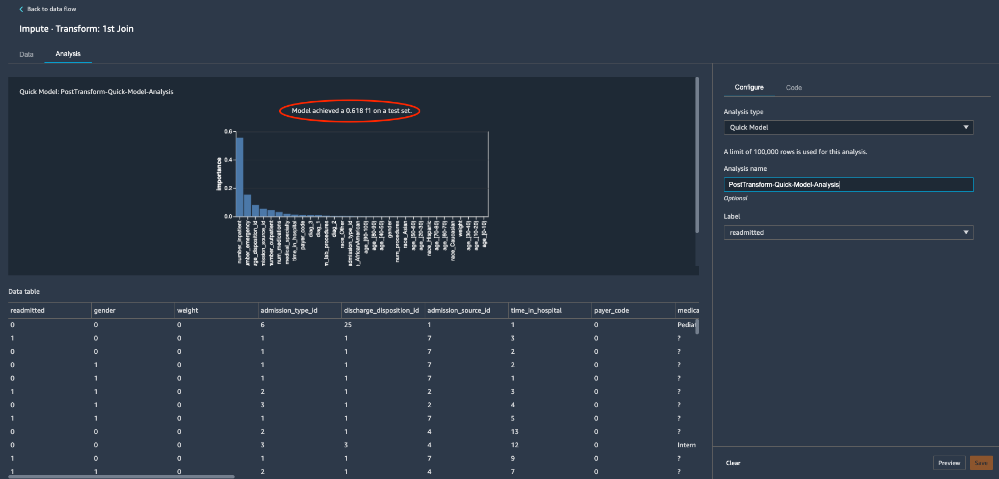

The resulting `Quick Model` F1 score shows `0.618` (your generated score might be different) with the transformed dataset. Under the hood Data Wrangler performs a number of steps to generate F1 score which includes Preprocessing, Training, Evaluating & finally calculating feature importance. More details about these steps can be found in our  [Quick Model](https://docs.aws.amazon.com/sagemaker/latest/dg/data-wrangler-analyses.html#data-wrangler-quick-model) documentation.  

Using this feature, Data Scientists can iterate through applicable transformations until they see desired transformed dataset that would potentially lead to business expectations.

5) Click `Create` button to add the quick model analysis to the data flow.


###  Export Options

We are now ready to export dataflow for further processing.

1) Save the DW flow file as shown below


2) Click `Export` tab and select `Steps` icon to reveal all the DW flow steps.  Click the last step to mark it as check (as shown in figure below)

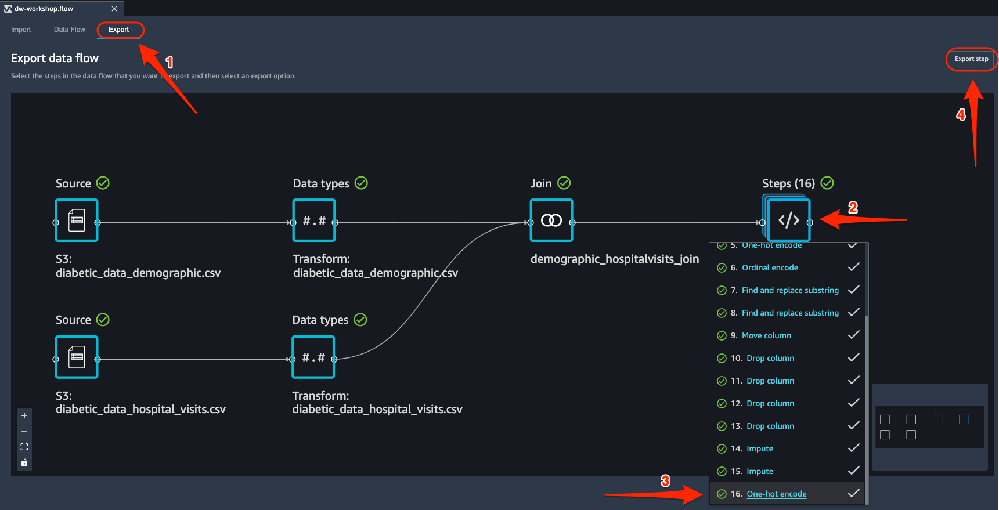

3) Click `Export step` to reveal the export options.  You currently have 4 export options

- `Save to S3` Save the data to an S3 bucket using a [Amazon SageMaker Processing](https://docs.aws.amazon.com/sagemaker/latest/dg/processing-job.html) Job.
- `Pipeline` exports a Jupyter Notebook that creates an [Amazon SageMaker Pipeline](https://aws.amazon.com/sagemaker/pipelines/) with your data flow.
- `Python Code` exports your data flow to python code.
- `Feature Store` exports a Jupyter Notebook that creates an [Amazon SageMaker Feature Store](https://aws.amazon.com/sagemaker/feature-store/) feature group and adds features to an offline or online feature store.

   You can find more information for each export option in this [page](https://docs.aws.amazon.com/sagemaker/latest/dg/data-wrangler-data-export.html).


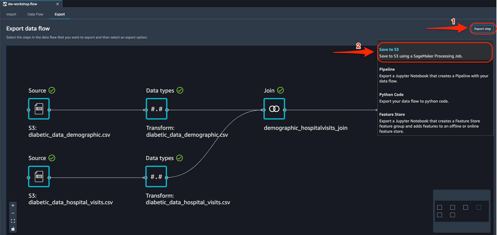

4) Select `Save to S3` to generate a fully implemented Jupyter Notebook that creates a processing Job using your data flow file.

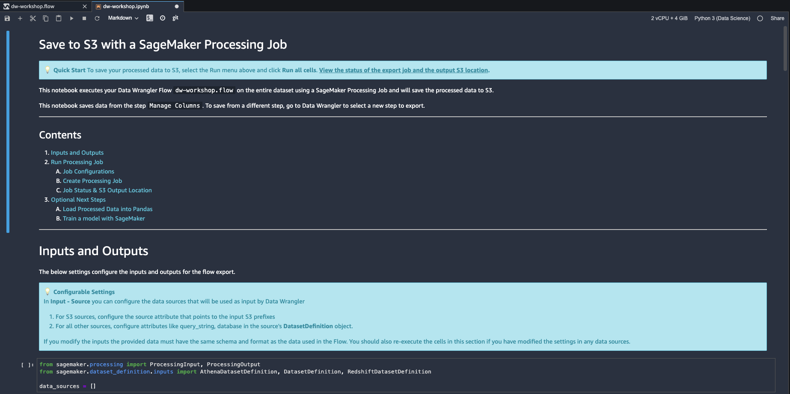


## 3. Processing and Training Jobs for Model building

###  Processing Job submission

1) We are now ready to submit a SageMaker Processing Job using the data flow file.  Run all the cells upto `Create Processing Job`.  This cell `Create Processing Job` will trigger a new SagaMaker processing job by provisioning managed infrastructure and running the required DataWrangler docker container on that infrastructure.

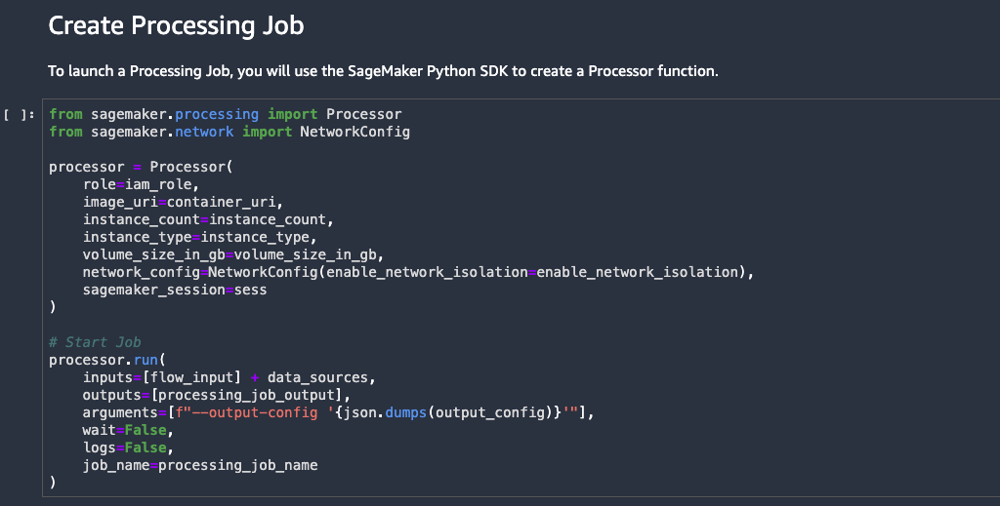

2) You can check the status of the submitted processing job by running next cell `Job Status & S3 Output Location`

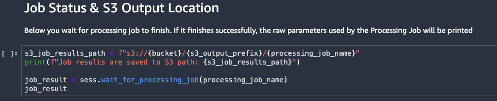


3) You can also check the status of the submitted processing job from Amazon SageMaker Console as shown below

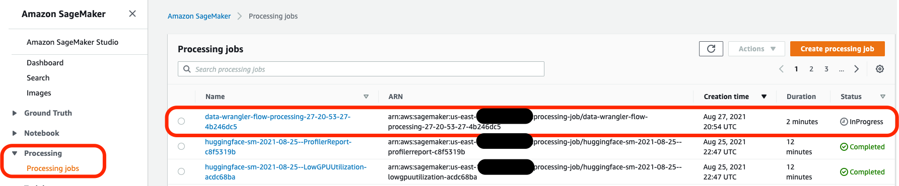


###  Train a model with Amazon SageMaker

1) Now that the data has been processed, you may want to train a model using the data.  The same notebook has sample steps to train a model using [Amazon SageMaker built-in XGBoost algorithm](https://docs.aws.amazon.com/sagemaker/latest/dg/xgboost.html).  Since our use case is binary classification, we need to change the `objective` to `"binary:logistic"` inside the sample training steps as shown below.


2) All set.  Now we are ready to fire our training job using SageMaker managed infrastructure.  Run the cell below.

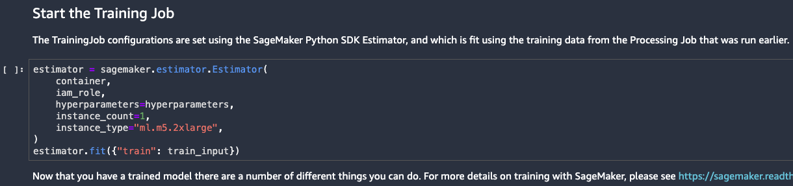

3) You can monitor the status of submitted training job in SageMaker Console under `Training`/`Training jobs` tab on the left.

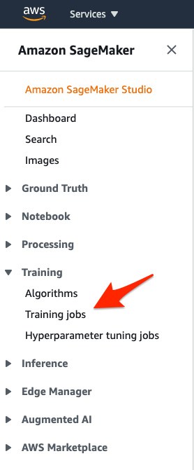

## 4. Host trained Model for real time inference

###  Deploy model for real-time inference

1) We will now use another notebook provided under project folder `hosting/Model_deployment_Steps.ipynb`.
This is a simple notebook with 2 cells - First cell has code for deploying your model to persistent endpoint.  Here you need to update `model_url` with your training job output `S3 model artifact`.  Here are image for reference.

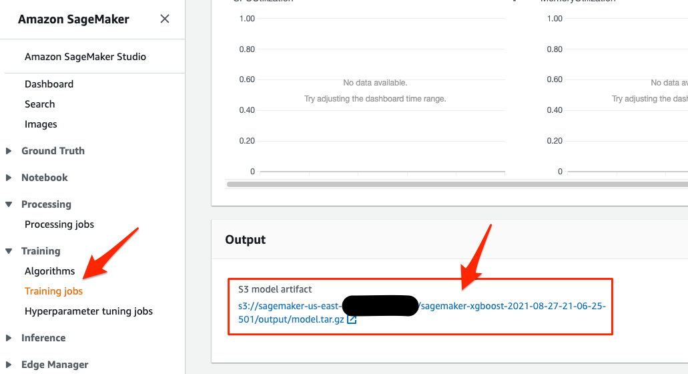


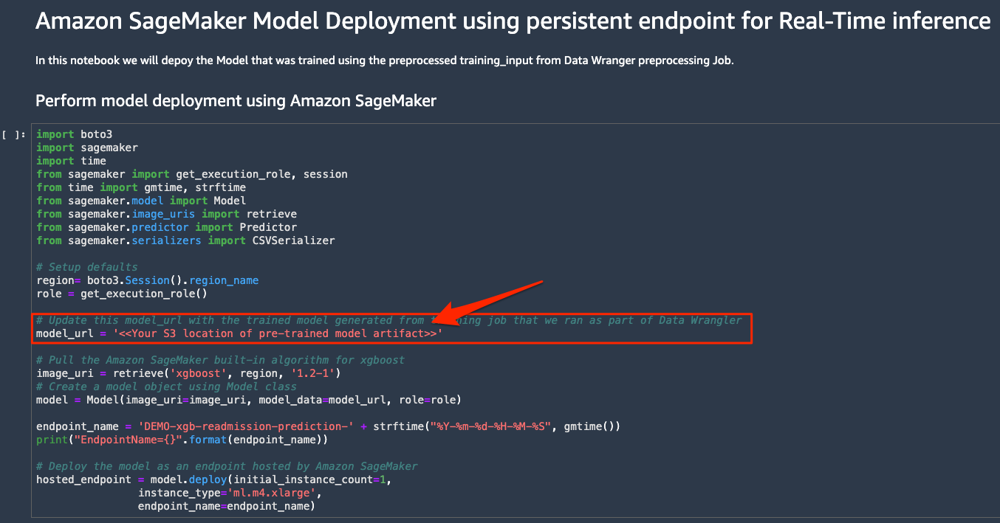

2) The second cell in the notebook will run inference on sample test file `test_data_UCI_sample.csv`.

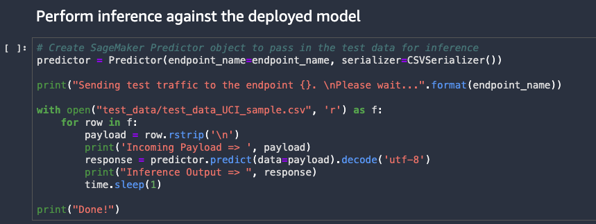


Clean up

After you have experimented above steps, perform the below 2 clean-up steps to stop incurring charges.

1.	Delete hosted endpoint.  You can do this from within SageMaker Console as shown below.

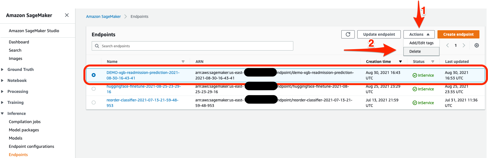

2.	Shutdown Data Wrangler App.  You can do this from within SageMaker Console by navigating to your SageMaker user-profile - as shown below.

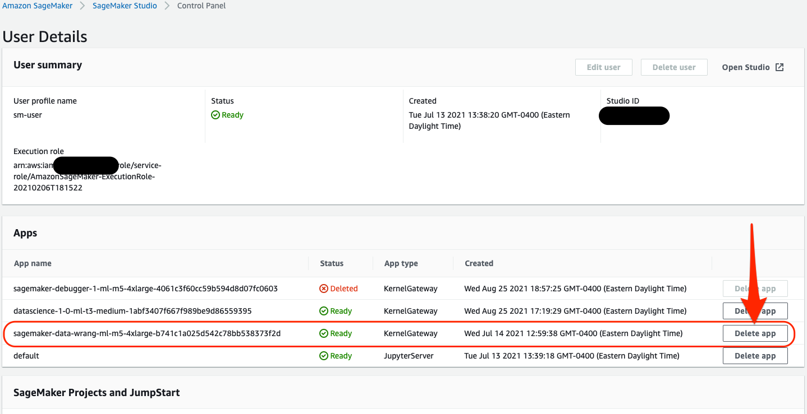


###  Conclusion

This concludes the example.  In this example you have learnt how to use SageMaker Data Wrangler capability to create data preprocessing, feature engineering steps using simple to use Data Wrangler GUI.  We then used the generated notebook to submit a SageMaker managed processing job to perform the data preparation using our data flow file.  Later we saw how to train a simple XGBoost algorithm using our processed dataset.  In the end we hosted our trained model and ran inferences against synthetic test data.
